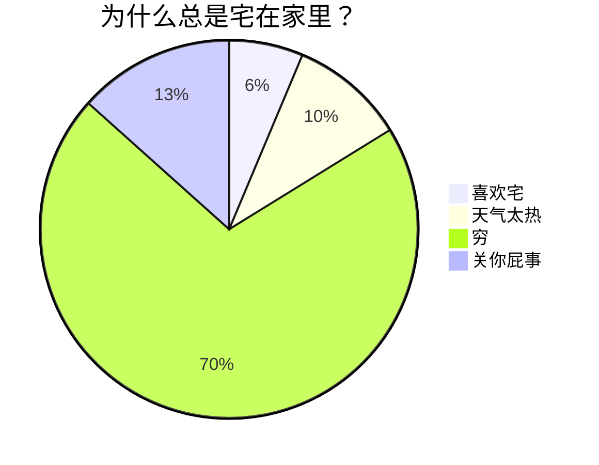

[toc]
## 目录的格式
 - 在文档的顶部 输入 **`[toc]`** ，会根据 **标题** 自动生成目录 ( **Table of Content** )

*这里一段斜体文本*
**粗体**
~~这是一段加了删除线的文本~~
***
<u>这是一段加了下划线的文本</u>

>这是第一段引用文本的第1行

[链接](链接地址 "提示信息文本")

| 这里是表头1 | 这里是表头2 | 这里是表头3 |     |        |        |        |
| :----- | :----: | -----: | --- | ------ | ------ | ------ |
| 单元格数据1 | 单元格数据2 | 单元格数据3 |     | 单元格数据4 | 单元格数据5 | 单元格数据6 |
`这是一行突出显示的文本内容`

```JAVASCRIPT
console.log('代码块')
```

- [ ] 待办任务列表
- [ ] 待办任务列表
 - [x] 已办任务列表1

<!-- 这里是注释的内容 -->

[百度一下，你就知道][度娘]
[度娘]: http://www.baidu.com

<kbd>键盘文本</kbd>
<kbd>Ctrl</kbd> + <kbd>X</kbd>

<big>这是一段放大文本</big>
<small>这是一段缩小文本</small>

<font color=orange>这是一段橘色文本</font>
==这里是一段高亮文本==


<audio controls="controls" preload="none" src="https://www.ldoceonline.com/media/english/exaProns/p008-001803372.mp3?version=1.2.30"></audio>


> [!INFO]- 信息
> 信息模块

> [!note]-  笔记
>  笔记模块

> [!abstract]-  abstract
>  abstract

> [!summary]-  笔记
>  笔记模块

> [!todo]-  todo
>  todo

> [!tip]-  tip
>  tip模块

> [!hint]-  hint
>  hint模块

> [!important]-  important
>  important模块

> [!success]-  success
>  success模块

> [!check]-  check
> check模块

> [!done]-  done
> done模块

> [!question]-  question
> question

> [!help]-  help
> help模块

> [!faq]-  faq
> faq模块

> [!warning]-  warning
> warning模块

> [!caution]-  caution
> caution模块

> [!attention]-  attention
> attention模块

> [!failure]-  failure
> failure模块

> [!fail]-  fail
> fail模块

> [!missing]-  missing
> missing模块

> [!danger]-  danger
> danger模块

> [!error]-  error
> error模块

> [!bug]-  bug
> bug模块

> [!example]-  example
> example模块

> [!quote]-  quote
> quote模块

> [!cite]-  cite
> cite模块

